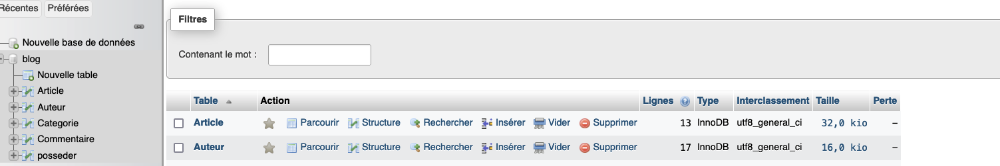
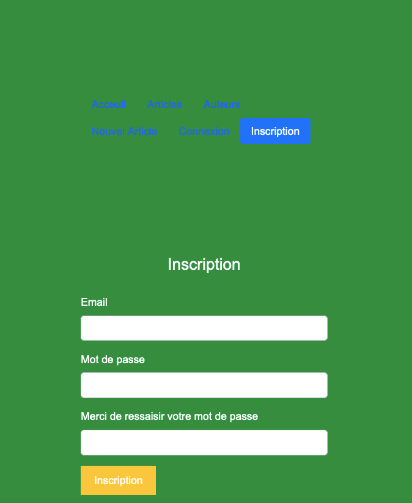
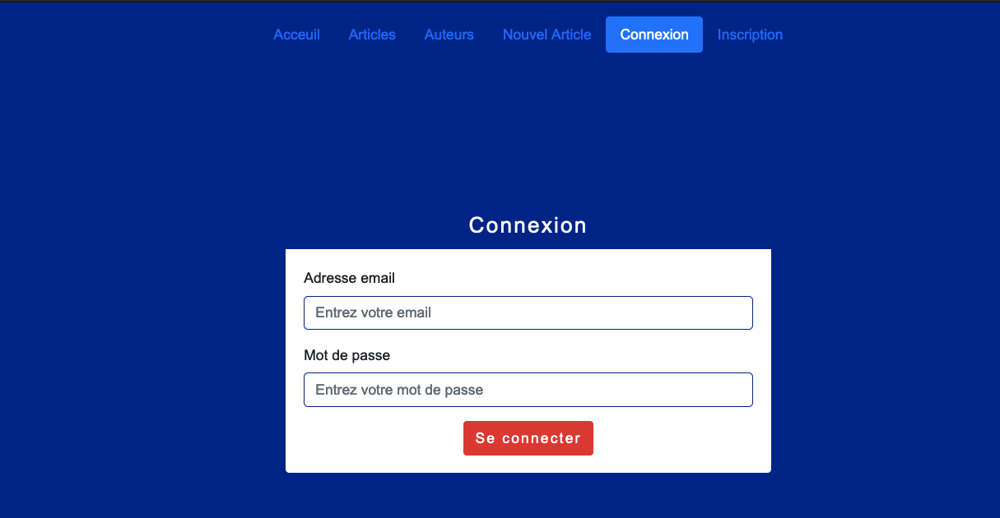

# Blog

Création d' un blog avec un Model Vue Controler (M-V-C) avec une database 



avec comme modèle une page article.php , auteur.php, article .php
PHP 
````php
<?php

require_once './bdd/connexion.php';

    class Category{

        public function GetAllCategory(){
             // appel la function d une connexion a la bdd
        $connexion = connect();

        // préparation de la requete
        $query = $connexion->prepare("SELECT * 
                                        FROM categorie");

        // execution
        $query->execute();

        // récupere les résultats
        $result = $query->fetchAll(PDO::FETCH_OBJ);

        // return le résultat
        return $result;


        }


    }
  ````

  en utilisant des templates PHTML
  ```html
  <!DOCTYPE html>
<html lang="fr">
<head>
    <meta charset="UTF-8">
    <meta http-equiv="X-UA-Compatible" content="IE=edge">
    <meta name="viewport" content="width=device-width, initial-scale=1.0">
    <title>Document</title>
    <?php include_once './include/script.php'; ?>
</head>
<body>
  <h1><?php echo $article->titre;?>
  (<?php echo date_format(date_create($article->date_publication), 'd/m/Y H:i:s');?>)
  </h1>
  <p>
    <?php foreach($category as $row){?>
        <?php echo $row->nom; ?>&nbsp;
      <?php } ?>
  </p>
   <p><?php echo $article->contenu; ?></p>
   <p><?php echo $article->nom; ?> <?php echo $article->prenom; ?></p>
   <p>image; ?> " alt="image_de_rose"></p>
   <p>
   <iframe width="560" height="315" src="<?php echo $article->video?>"title=" YouTube video player" frameborder="0" allow="accelerometer; autoplay; clipboard-write; encrypted-media; gyroscope; picture-in-picture; web-share" allowfullscreen></iframe>
   </p>
  
</body>
</html>
```
Une page enregistrement a été créer

Une page de connexion a été créer pour se connecter



    


 


